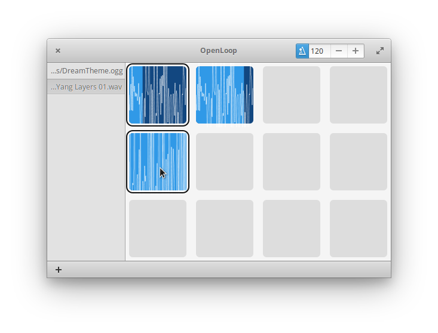

# OpenLoop
OpenLoop is an effort to create a sample looping environment for elementaryOS.
It is heavily inspired by the [Live Loops](https://support.apple.com/guide/garageband-ipad/live-loops-overview-chsca7ff9ced/ipados) feature of GarageBand

The application consists of a list of audio samples which can be imported by the user, and a grid of tiles that these samples can be dragged and dropped onto.
The starting and stopping of samples is synchronized using the metronome. When a sample on the grid is clicked, it is scheduled to start/stop playing at the start of the next bar.
At the current stage the application supports inserting a single (raw format) sample file onto the grid, playing it, dragging it around, and deleting it.

The audio aspect of the application is implemented as a GStreamer pipeline.
Currently, the scheduling of sample starts/stops is done using the metronome by having a list of actions that need to happen at the next bar (see scheduledevents.vala).
The last commit tries to offload this to the GStreamer Editing Services library to do this for us, creating a timeline for future samples being played under the hood.
This would allow the application to export the composition as an WAV file without having to play/record it at its actual speed.

For the most usable version, reset to the third latest commit (ca579fd).

### Features

 * Delete multiple tiles using ctrl-click
 * Intuitive drag'n'drop
 * Visual feedback when a beat happens

### Bugs

 * Metronome only starts on some occasions for some reason.
 * Audio only works on some runs.

### Wishlist

 * Pitch-shifting/time-stretching samples (using `librubberband`)
 * MIDI sequencing (like in GarageBand's Live Loops)
 * scroll-lock LED flash in time to metronome beats (see code in xledflash.c)
